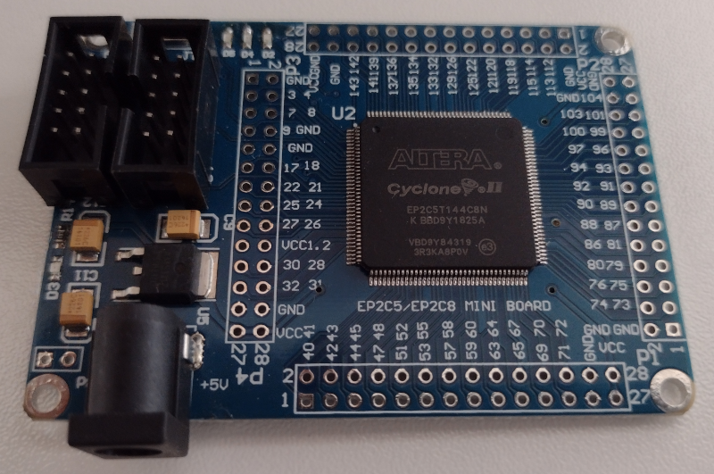

# Altera Cyclone II Board

Ebay EP2C5144C8N minimal board.

## Device Specs

* 4609 Logic Elements
* 288 Logic Array Blocks
* 119,808 bits RAM 
* 13 (18x18) Embedded Multipliers
* 2 PLL
* 89 User I/O Pins

## Board Specs

* 50 Mhz oscillator
* EEPROM chip

## References

* [Device Handbook](https://octopart.com/datasheet/altera/EP2C5T144C8N)

