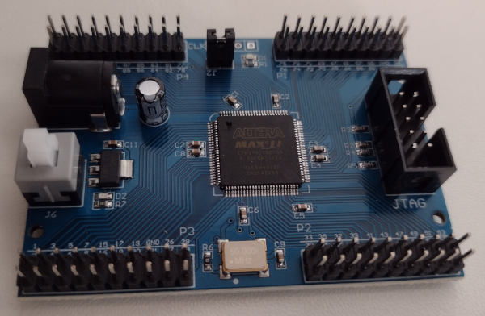

# Altera Max II CPLD

Ebay EPM240T100I5N board

## Device Specs

* 240 Logic Elements
* 192 Macrocells
* 24 Logic Array Blocks

## Board Specs

* 50 Mhz oscillator
* JTAG Header
* 5V Power Connector
* 100 pins

## References

* [MAXII Device Handbook](https://www.mouser.com/catalog/specsheets/Intel_max2_mii5v1.pdf)
